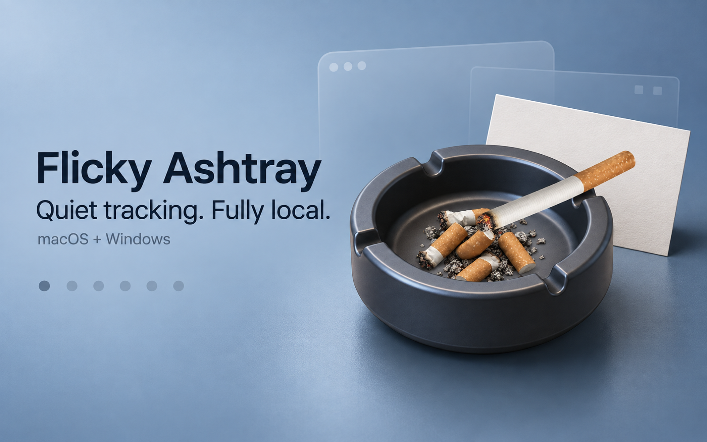

# Flicky Ashtray

一个安静地常驻在桌面的吸烟记录小工具。可以选择烟灰缸或桌面便签，点一下记一根，悬停查看今天状态；所有数据只保存在本机。

Flicky Ashtray is a quiet native desktop smoking log for macOS and Windows. Choose an ashtray or compact note, tap once to log, hover for today’s status, and keep all data on-device.



## 直接下载 / Download

- [⬇️ 下载 macOS 版（DMG，macOS 13+ / Apple Silicon）](https://github.com/doublesq97-ui/flicky-ashtray/releases/download/v0.4.0/Flicky-Ashtray-0.4.0-arm64.dmg)
- [⬇️ 下载 Windows 预览版（ZIP，Windows 10/11 x64）](https://github.com/doublesq97-ui/flicky-ashtray/releases/download/v0.5.0-preview.1/Flicky-Ashtray-0.5.0-preview.1-windows-x64.zip)

macOS 打开 DMG 后将应用拖入 `Applications`。Windows 需先完整解压 ZIP，再运行 `FlickyAshtray.exe`；当前预览版尚未使用 Authenticode 商业证书签名，首次启动可能显示“未知发布者”。详情见 [`Windows/README.md`](Windows/README.md)。

## 平台状态 / Platform status

| 平台 | 当前状态 | 下载形式 |
| --- | --- | --- |
| macOS 13+，Apple Silicon | 原生 Swift 稳定版 | Developer ID 签名并经 Apple 公证的 DMG |
| Windows 10/11 x64 | 原生 C# / WPF 预览版，等待 Windows 实机验收 | 自带 .NET 运行时的 ZIP / EXE |

## 功能 / Features

- 可配置每日上限（1–60，默认 8）与日切时间
- 跨日间隔、每个计数日一次撤销、7 日趋势
- 7 天正向目标、花朵进度与自定义奖励约定
- 原生生成最近 7 个计数日的 PNG 小结
- 周报导出自动跟随系统外观：浅色白蓝、深色黑绿
- 写明原因并双重确认的历史重置，保留本机审计记录
- 悬停查看、点击固定、右键隐藏、菜单栏恢复
- 烟灰缸／桌面便签两种桌宠外观，支持 60%–100% 缩放
- 桌面便签使用同心圆点烟器记一根，并自动跟随 macOS 浅深色
- 浅色／深色系统主题与减少动态支持
- 全本地 JSON 存储，无账号、无联网、无分析

## 原生实现 / Native implementation

macOS 版使用 Swift、AppKit 与 SwiftUI；Windows 版使用 C#、.NET 与 WPF。桌面只常驻透明无边框小桌宠，记录、趋势和设置位于按需打开的原生控制面板。两个版本共用同一套 v8 JSON 数据结构和计数规则，不依赖 WebView、Electron 或 Tauri。

## 开发 / Development

```bash
npm install
npm test
npm run build:mac
```

构建产物位于 `dist/Flicky Ashtray.app` 与 `dist/Flicky-Ashtray-0.4.0-arm64.dmg`。

默认命令生成仅供本机预览的 ad-hoc 签名包。维护者发布正式版本时，通过环境变量提供 Developer ID 标识和本机公证钥匙串配置：

```bash
FLICKY_SIGN_IDENTITY="Developer ID Application: …" \
FLICKY_NOTARY_PROFILE="你的 notarytool profile" \
npm run build:mac
```

Windows x64 自包含预览包：

```bash
./scripts/build-windows.sh
```

Windows 的可移植业务逻辑测试可以在 macOS、Linux 或 Windows 上运行；WPF 界面需要 Windows 10/11 实机完成最终体验验收。

## 数据与隐私 / Data & privacy

数据不会离开你的电脑：

- macOS：`~/Library/Application Support/Flicky Ashtray/store.json`
- Windows：`%LocalAppData%\Flicky Ashtray\store.json`

主记录与最后可用备份会一同更新；遇到损坏或未来版本数据时，应用会进入只读保护，避免静默覆盖。

## 作者 / Author

Sukiea1008（[@doublesq97-ui](https://github.com/doublesq97-ui)）

## 源码使用边界 / Source availability

这个仓库公开源代码，方便个人学习、研究、非商业修改与分享；它不是允许任意商用的 OSI 开源项目。

The source is publicly available for personal study, research, and other noncommercial use. This is not an OSI-approved open-source project and does not grant unrestricted commercial rights.

- 源码与文档：PolyForm Noncommercial 1.0.0
- `assets/` 中的图像：CC BY-NC 4.0
- 任何商业使用、商业分发或商业产品集成，须事先取得版权所有者的书面许可

完整条款见 [`LICENSE`](LICENSE) 与 [`assets/LICENSE.md`](assets/LICENSE.md)。商业授权可通过作者的 GitHub 主页联系。
